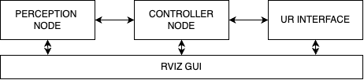

# UR5 Controller ROS2 Humble Mediapie

## Table of Contents

- [Introduction](#introduction)
- [Prerequisites](#prerequisites)
- [Package Description](#package-description)
- [Installation](#installation)
- [Usage](#usage)
- [Authors and Acknowledgment](#authors-and-acknowledgment)

## Introduction

This repository contains code for controlling a UR5 Robot using Mediapie with the software architecture depicted below:

<p align="center">
    
</p>

The software architecture consists of three main nodes (Perception Node, Controller Node, UR Interface) and an RViz GUI for visualization and interaction.

## Prerequisites

Before you begin, ensure you have met the following requirements:

- Ubuntu 22.04
- ROS2 Humble
- Network connection with a static IP address for the USV

## Package Description

The package is structured as follows:

- **Perception Node**: Handles camera data and processes using mediapie for the controller node.
- **Controller Node**: Manages the logic for controlling the UR5 robot based on input from the perception node and user commands from the RViz GUI.
- **UR Interface**: Communicates with the UR5 hardware to execute control commands.
- **RViz GUI**: Provides a graphical interface for visualization and interaction with the robot system.

## Installation

Follow these steps to install and set up the package:

1. **Clone the repository**:

   ```bash
   git clone https://github.com/yourusername/ur5_controller.git
   cd ur5_controller
   ```

2. **Build the package**:

   ```bash
   colcon build
   ```

3. **Source the setup script**:
   ```bash
   source install/setup.bash
   ```

## Usage

To run the system, follow these steps:

1. **Launch the bringup file**:

   ```bash
   ros2 launch ur5_controller bringup.launch.py
   ```

2. **Open RViz for visualization**:
   ```bash
   ros2 run rviz2 rviz2 -d path_to_your_rviz_config.rviz
   ```

## Authors and Acknowledgment

Agus Darmawan - [wayanagus.dr@gmail.com](mailto:wayanagus.dr@gmail.com)

Special thanks to the ROS community and contributors for providing valuable resources and support.
